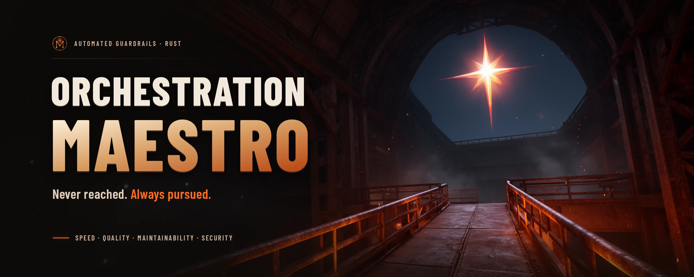

  

# Orchestration Maestro

**Never reached. Always pursued.**

Automated guardrails let you develop faster, write better and more maintainable
code, and raise your security posture at the same time. Speed, quality,
maintainability and security are not a trade-off: automation is what lets one
repository have all four.

That is our Northstar. A Northstar is never reached: it is the impossible
objective we set ourselves so we keep surpassing ourselves. Every repository
steers by it, with four pillars and one measured KPI each.

| | Pillar | KPI in `rust-workflows` | Today | Target |
| --- | --- | --- | --- | --- |
|  | **Speed** | `just check` wall time, tools cached | 31 s, read 2026-09-18 | 40 s or less |
|  | **Quality** | Line coverage floor | 90%, every run | 90% |
|  | **Maintainability** | Undocumented items in the gate crate | 0, every run | 0 |
|  | **Security** | Silenced lints | 0, every run | 0 |

These are targets, not a claim that every one is met: see
[northstar.md](https://github.com/Orchestration-Maestro/rust-workflows/blob/main/docs/standards/northstar.md).

| Repository | What it is |
| --- | --- |
| [maestro-core](https://github.com/Orchestration-Maestro/maestro-core) | The Rust core of Maestro, starting with document ingestion |
| [rust-workflows](https://github.com/Orchestration-Maestro/rust-workflows) | The shared, security-gated CI every Rust repository calls |

Found a vulnerability? Report it privately: see our
[security policy](https://github.com/Orchestration-Maestro/.github/blob/main/SECURITY.md).
